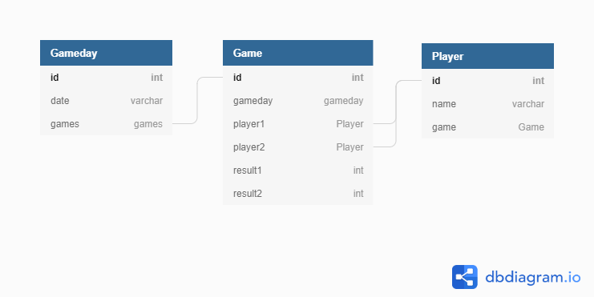

# fff-badminton

 


[](https://snyk.io/test/github/JohannesKonings/fff-badminton)

[](https://lgtm.com/projects/g/JohannesKonings/fff-badminton/alerts/)
[](https://lgtm.com/projects/g/JohannesKonings/fff-badminton/context:javascript)

<!--https://github.com/badges/shields-->

# Template

[](https://gitter.im/creative-tim/material-dashboard?utm_source=share-link&utm_medium=link&utm_campaign=share-link) 
[](https://discord.gg/E4aHAQy)

[Material Dashboard React](https://demos.creative-tim.com/material-dashboard-react/#/dashboard) [](https://twitter.com/intent/tweet?url=https%3A%2F%2Fcreativetimofficial.github.io%2Fmaterial-dashboard-react&text=Material%20Dashboard%20React%20-%20Free%20Bootstrap%20Admin%20Template&original_referer=https%3A%2F%2Fdemos.creative-tim.com%2Fmaterial-dashboard-react%2F%3F_ga%3D2.10428917.198078103.1532329372-1803433978.1528781151&via=creativetim&hashtags=react%2Cmaterial-ui)

## Documentation
The documentation for the Material Dashboard React is hosted at our [website](https://demos.creative-tim.com/material-dashboard-react/#/documentation/tutorial).

# Technical description of the webapp

https://dev.to/johanneskonings/aws-amplify-api-graphql-mutation-5ba4

# development

https://aws.amazon.com/de/amplify/

# data model



## local dev

```sh
amplify mock
```

## test

```sh
npx cypress open
npm run cypress:open
```
